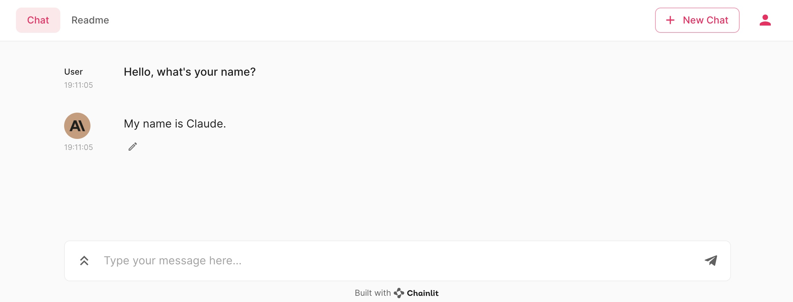

# Your own Claude by Anthropic 🔥

This folder contains a simple Chainlit application that integrates with the Anthropic API to create an interactive chat experience with Claude, an AI developed by Anthropic.

## High-Level Description

The `app.py` script sets up a Chainlit chat interface that communicates with the Anthropic API. When a chat starts, it initializes a session and displays an avatar for Claude. As users interact with the chat, their queries are sent to the Anthropic API, which generates responses using the Claude model. The conversation history is maintained in the session to provide context for Claude's responses.

## Quickstart

To get started with your own Claude chatbot using the Anthropic API:

1. Ensure you have an Anthropic API key. Set this key in your environment variables as `ANTHROPIC_API_KEY`.

2. Install the required Python packages by running:
```shell
pip install -r requirements.txt
```
3. Run the `app.py` script to start the Chainlit server.
```shell
chainlit run app.py
```

4. Interact with Claude through the Chainlit interface.

### Function Definitions

- `start_chat`: Initializes the chat session and sets up the avatar for Claude.
- `call_claude`: Sends the user's query to the Anthropic API and streams the response back to the chat interface.
- `chat`: Receives messages from the user and passes them to the `call_claude` function.

For more details on the Anthropic API and how to obtain an API key, visit [Anthropic's official website](https://www.anthropic.com/).

