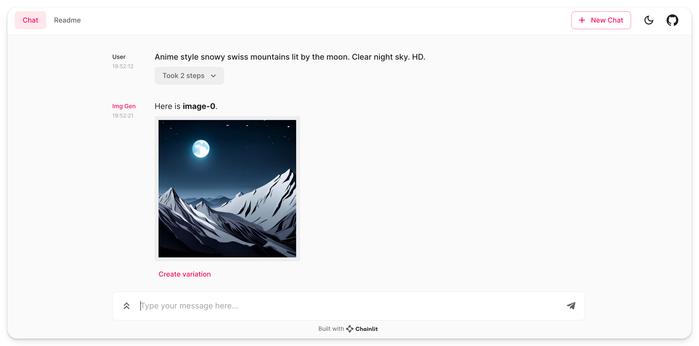

Title: Image Generation with Chainlit
Tags: [image, stability, langchain]

# Image Generation with Chainlit

This folder is showing how to use Stability AI to generate images and send them to the Chainlit UI.

You will learn on how to use the [Image element](https://docs.chainlit.io/api-reference/elements/image) and integrate it with LangChain.

## Description

The provided code integrates Stability AI's image generation capabilities with Chainlit, a framework for building interactive web apps with Python. It includes functions to generate new images from text prompts and to edit existing images using prompts. The image generation is powered by the Stability AI's API, and the images are displayed using Chainlit's Image element.

## Quickstart

1. Ensure you have Chainlit installed and set up.
2. Place your Stability AI API key in the environment variable `STABILITY_KEY`.
3. Run `app.py` to start the Chainlit app.
4. Use the `generate_image` function to create a new image from a text prompt.
5. Use the `edit_image` function to edit an existing image with a new prompt.

## Functions

- `generate_image(prompt: str)`: Generates an image from a text prompt and returns the image name.
- `edit_image(init_image_name: str, prompt: str)`: Edits an existing image based on the provided prompt and returns the new image name.

## Tools

- `generate_image_tool`: A Chainlit tool for generating images from text prompts.
- `edit_image_tool`: A Chainlit tool for editing images with text prompts.

To see the tools in action and interact with the generated images, follow the instructions in the [main readme](/README.md).

