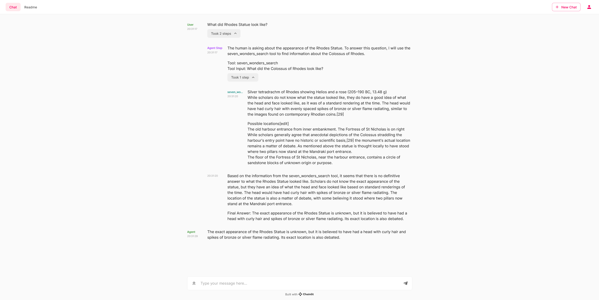

Title: Conversational Agent with Deepset Haystack
Tags: [haystack]

# Conversational Agent with Deepset Haystack

## Quickstart

To get started with this conversational agent, follow these steps:

1. Ensure you have an OpenAI API key and set it as an environment variable `OPENAI_API_KEY`.
2. Install the required libraries with `pip install chainlit haystack datasets`.
3. Run the `app.py` script to start the conversational agent.

### Key Functions

- `get_retriever()`: Initializes the document store and loads the dataset for the Seven Wonders. It returns a BM25Retriever instance for searching documents.
- `get_agent(retriever)`: Sets up the conversational agent with the necessary tools and prompt template for interaction.
- `init()`: Starts the conversation with an initial question about the Rhodes Statue.
- `answer(message: cl.Message)`: Handles incoming messages and provides responses from the agent.

### How to Use

Send a message to the agent using the `init()` function or the `answer()` function for follow-up questions. The agent will process the question and provide an answer based on the information retrieved from the dataset.

## Resources

- [Haystack - Github](https://github.com/deepset-ai/haystack)
- [Haystack - Documentation](https://docs.haystack.deepset.ai/docs)
- [Haystack - Full Tutorial](https://haystack.deepset.ai/tutorials/25_customizing_agent)

This example is an adapted tutorial from the haystack website using chainlit and the `HaystackAgentCallbackHandler`.

