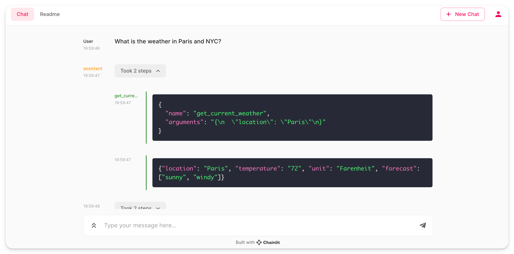

Title: OpenAI functions with Chainlit
Tags: [openai-functions]

# OpenAI functions with Chainlit

This folder is showing how to use OpenAI functions with Chainlit.

OpenAI functions enable GPT to use functions you defined in your code.
To run the example, follow the instructions of the [main readme](/README.md).

## Quickstart

To get started with using OpenAI functions in Chainlit, follow these steps:

1. Clone the repository and navigate to the `openai-functions` directory.
2. Ensure you have an OpenAI API key and set it as an environment variable `OPENAI_API_KEY`.
3. Define your custom functions that you want GPT to use. For example, a simple weather function is provided:
```python
def get_current_weather(location, unit="Fahrenheit"):
"""Get the current weather in a given location"""
weather_info = {
"location": location,
"temperature": "72",
"unit": unit,
"forecast": ["sunny", "windy"],
}
return json.dumps(weather_info)
```
4. Use the `@cl.step` decorator to create steps that call your custom functions and handle the interaction with the GPT model.
5. Run your Chainlit app using the provided `app.py` as a starting point.
6. Interact with your application through the Chainlit interface, where you can chat with GPT-4 and it will use your custom functions to respond.

Remember to follow the instructions in the [main readme](/README.md) for setting up your Chainlit environment.


Title: OpenAI functions with Chainlit
Tags: [open-ai, functions]