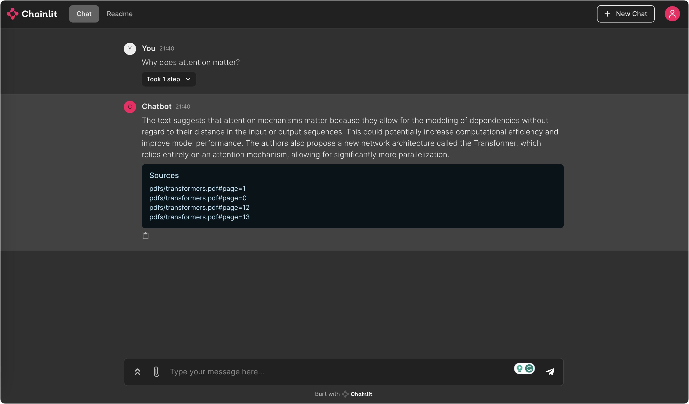

# Chroma Q&A with Sources Element

This repository contains a Chainlit application that provides a question-answering service using documents stored in a Chroma vector store. It allows users to upload PDF documents, which are then chunked, embedded, and indexed for efficient retrieval. When a user asks a question, the application retrieves relevant document chunks and uses OpenAI's language model to generate an answer, citing the sources it used.

## High-Level Description

The `app.py` script performs the following functions:

1. **PDF Processing (`process_pdfs`)**: Chunks PDF files into smaller text segments, creates embeddings for each chunk, and stores them in Chroma.
2. **Document Indexing (`index`)**: Uses `SQLRecordManager` to track document writes into the vector store.
3. **Question Answering (`on_message`)**: When a user asks a question, the application retrieves relevant document chunks and generates an answer using OpenAI's language model, providing the sources for transparency.

## Quickstart

### Prerequisites

- Python 3.11 or higher
- Chainlit installed
- PDF documents to be indexed

### Setup and Run

1. **Install Dependencies:**

Install the required Python packages specified in `requirements.txt`.

```shell
pip install -r requirements.txt
```

2. **Process PDFs:**

Place your PDF documents in the `./pdfs` directory.

3. **Run the Application:**

Use the provided `Dockerfile` to build and run the application.

```shell
docker build -t chroma-qa-chat .
docker run -p 7860:7860 chroma-qa-chat
```

   Access the application at `http://localhost:7860`.

## Code Definitions

- `process_pdfs`: Function that processes PDF files and indexes them into Chroma.
- `on_chat_start`: Event handler that sets up the Chainlit session with the necessary components for question answering.
- `on_message`: Event handler that processes user messages, retrieves relevant information, and sends back an answer.
- `PostMessageHandler`: Callback handler that posts the sources of the retrieved documents as a Chainlit element.



## See Also

For a visual guide on how to use this application, watch the video by [Chris Alexiuk](https://www.youtube.com/watch?v=9SBUStfCtmk&ab_channel=ChrisAlexiuk).

