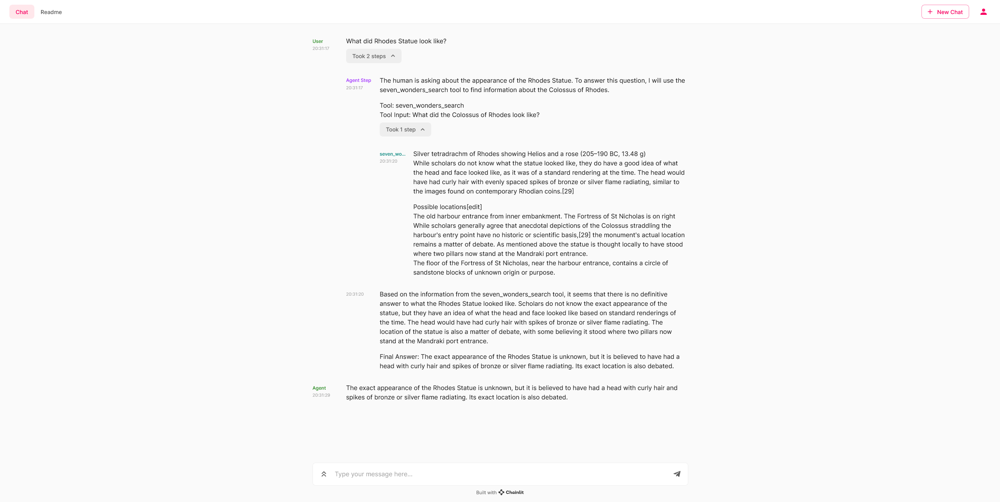

# Conversational Agent with Deepset Haystack

## Resources
- [Haystack - Github](https://github.com/deepset-ai/haystack)
- [Haystack - Documentation](https://docs.haystack.deepset.ai/docs)
- [Haystack - Full Tutorial](https://haystack.deepset.ai/tutorials/25_customizing_agent)

This example is an adapted tutorial from the haystack website using chainlit and the `HaystackAgentCallbackHandler`

