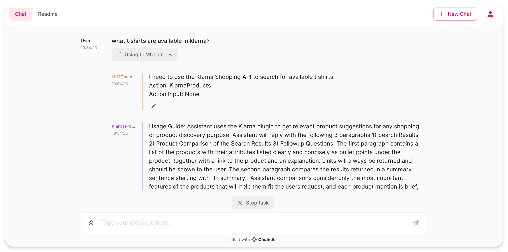

Title: ChatGPT plugins & LangChain
Tags: [chatgpt, langchain, plugins]

# LangChain AI plugins

This directory contains an example of how to integrate public ChatGPT plugins with LangChain and Chainlit. It demonstrates the setup of a simple Chainlit application that utilizes an AI plugin to enhance the capabilities of a LangChain agent.

## Description

The `app.py` script initializes a LangChain agent with a ChatGPT model and an external AI plugin. The AI plugin is loaded from a specified URL and combined with other tools to create a versatile agent. This agent can then process incoming messages and provide responses using both its built-in capabilities and the additional functionality provided by the AI plugin.

## Quickstart

To get started with this example:

1. Ensure you have Chainlit and LangChain installed in your environment.
2. Clone this repository and navigate to the `chainlit-cookbook/langchain-aiplugins` directory.
3. Run the `app.py` script to start the Chainlit application.
4. Interact with the application through the Chainlit interface to see the LangChain agent and AI plugin in action.

## Code Definitions

- `AIPluginTool.from_plugin_url`: Loads an AI plugin from the provided URL.
- `ChatOpenAI`: Initializes a ChatGPT model with specified parameters.
- `load_tools`: Loads additional tools that can be used by the agent.
- `initialize_agent`: Creates a LangChain agent with the loaded tools and AI plugin.
- `AgentExecutor`: Executes the agent's actions based on incoming messages.
- `cl.on_chat_start`: Decorator to initialize the agent when the chat starts.
- `cl.on_message`: Decorator to define the main message handling loop of the application.

Follow the instructions in the [main readme](/README.md) to set up your environment and run the example.
