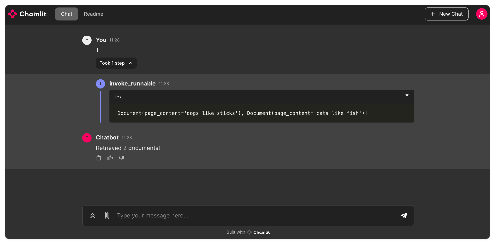
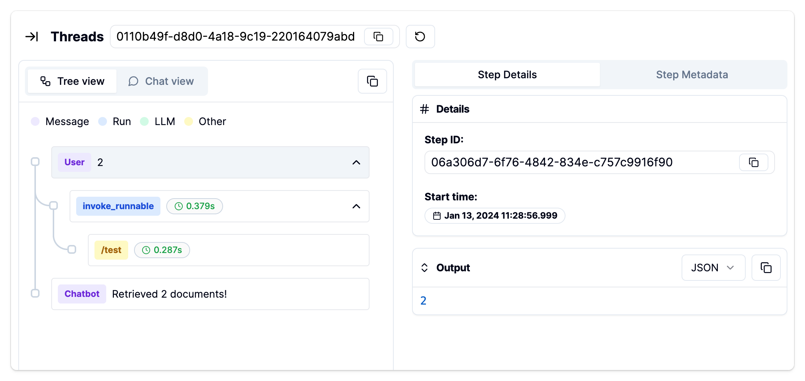

# Literal AI + Chainlit + Langserve

## Configure Langserve

Go to `langserve-app/app` and create a `.env` file based on `.env.example`.

Then run `python server.py` to run the langserve server.

## Configure Chainlit

Go to `chainlit-app` and create a `.env` file based on `.env.example`.

Then run `chainlit run app.py` and type something.

Then go to [Literal AI](https://cloud.getliteral.ai) and check the freshly created thread.

