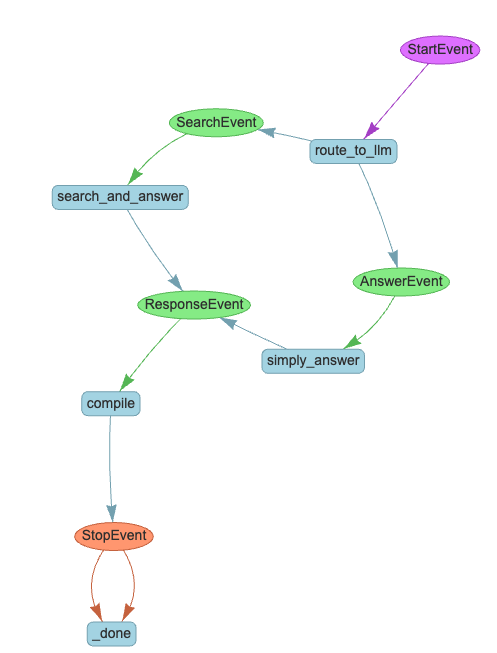

# LlamaIndex Workflow meets Chainlit
This cookbook aims to show how to use LlamaIndex's latest Workflow abstraction with Chainlit!


## What is a Workflow?
A workflow is an event-driven abstraction. Unlike having to define agentic systems as digraphs, LlamaIndex's Workflow abstraction allows you to just define the events within the workflow and what happens when these events get triggered. The result is being able to write performant multi-agent / multi-llm applications within far fewer lines of code. Oh and it has type checking too so that goodbye type-related bugs!

## Getting started
You will need your TAVILY API key and OpenAI API key to run this demo. Key those into your .env file.

To install requirements:
```
pip install -r requirements.txt
```

To run the app
```
chainlit run app.py --watch
```

## The app
Our workflow application includes a function calling agent and a simple chat engine. When asked a question, the workflow triggers 2 events - a search online and answer event and a "simply answer" event without any searching. 
- The first event uses Tavily to do the online search, and the agent then extracts the search results to reply. 
- The second event simply uses the LLM to reply without any searching. 

Since the second event might cause the LLM to hallucinate, we have a 3rd `compilation` event to select the best answer.

It really is quite simple to visualize the "chain of thought" in the workflow - simply add a `@cl.step` decorator on top of LlamaIndex's Workflow `@step` decorator for each workflow event.

