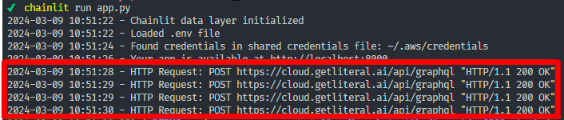

If you want to silence the HTTP Requst logs that fill up the logs, you can silence them with the following lines of code: 



```
# app.py
import logging
logging.getLogger("httpx").setLevel("WARNING")
```