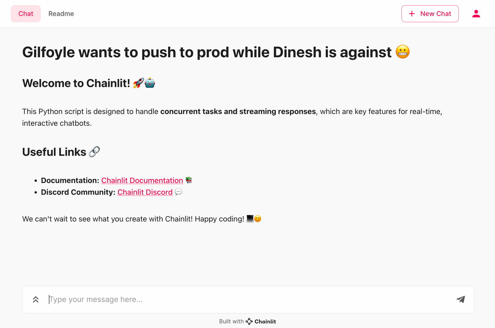

# Two OpenAI bots streaming in parallel with Chainlit

This Python script is designed to handle concurrent tasks and streaming responses, which are key features for real-time, interactive chatbots.

## Key Features

- Concurrent Tasks Execution: The script uses Python's asyncio library to run multiple tasks concurrently. This is demonstrated in the main function where `answer_as` function is called concurrently for "Gilfoyle" and "Dinesh".

- Streaming Responses: The script uses OpenAI's ChatCompletion API to stream responses from the GPT-3.5 model. This is demonstrated in the `answer_as` function where the stream=True argument is passed to the openai.ChatCompletion.acreate method.

This script is a great starting point for anyone looking to build a chatbot with concurrent task execution and streaming responses using Chainlit and OpenAI. 

Title: Concurrent Streaming with OpenAI
Tags: [open-ai, concurrent-streaming]