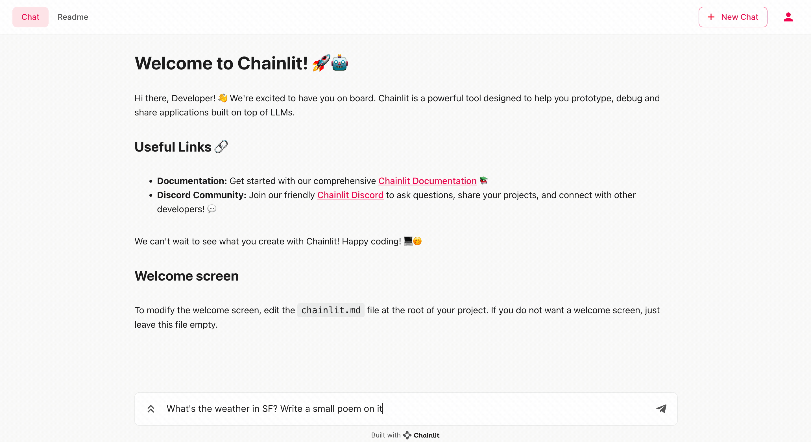

# OpenAI functions streaming with Chainlit

This folder is showing how to use OpenAI functions with Chainlit.

OpenAI functions enable GPT to use functions you defined in your code.
To run the example, follow the instructions of the [main readme](/README.md).

