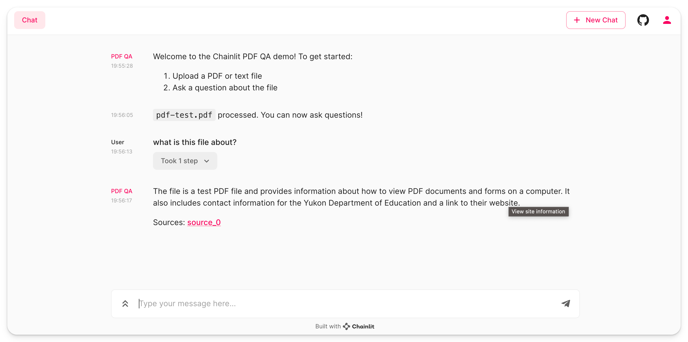

# PDF Question & Answering

This folder is showing how to:

- Ask a user for a PDF file
- Chunk that file and create embeddings
- Store those embeddings on Pinecone
- Answer questions from users as well as showing the sources used to answer.

## Quickstart

To get started with this application, follow these steps:

1. Ensure you have Pinecone API key set in your environment variables as `PINECONE_API_KEY` and `PINECONE_ENV`.
2. Run the `app.py` script to start the Chainlit server.
3. Interact with the application through the Chainlit interface to upload a file and ask questions.

### Key Functions

- `process_file(file: AskFileResponse)`: Processes the uploaded file, determining if it's a PDF or text file, and splits it into chunks for embedding.
- `get_docsearch(file: AskFileResponse)`: Takes the processed file, saves the data in the user session, and creates or retrieves a Pinecone index for the file's namespace.
- `start()`: An asynchronous function that initiates the chat, prompts the user to upload a file, processes the file, and sets up the conversational retrieval chain.
- `main(message: cl.Message)`: The main asynchronous function that handles incoming messages, retrieves answers from the conversational retrieval chain, and sends responses back to the user.

To run the example, follow the instructions of the [main readme](/README.md).

Title: PDF Question & Answering
Tags: [pdf, q&a]
